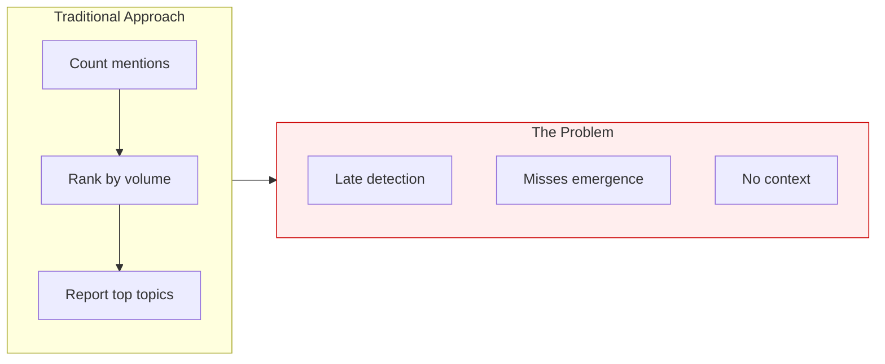
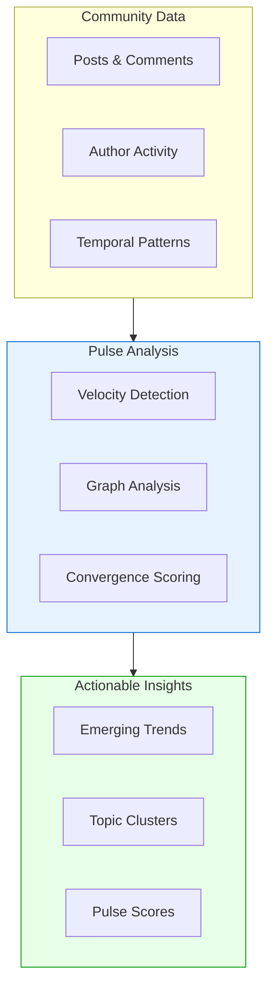
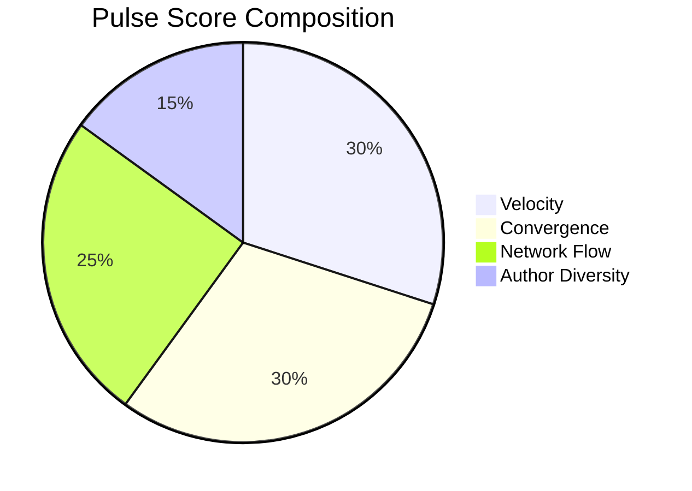
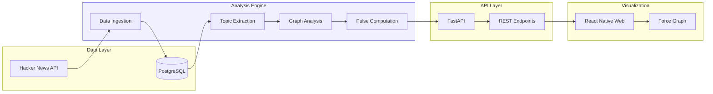
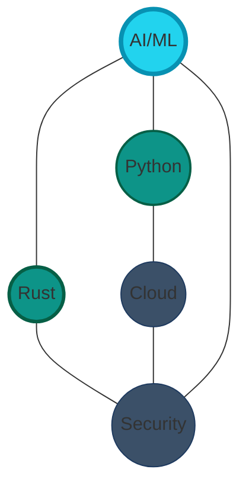
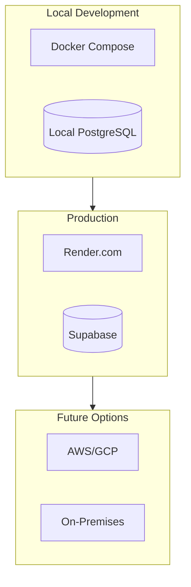
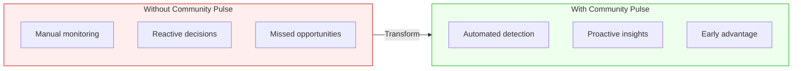

# Community Pulse

**Detecting Emerging Trends Before They Peak**

---

## The Challenge

Online communities generate thousands of discussions daily. Hidden within this noise are **emerging signals**—topics gaining momentum that indicate where collective attention is heading.

Traditional trend detection methods fail because they:

- React **after** trends have already peaked
- Miss **convergence patterns** (multiple voices independently discovering the same insight)
- Ignore the **network structure** of how information flows through communities



**Result**: By the time a trend appears on traditional dashboards, the opportunity window has closed.

---

## The Solution

Community Pulse detects **emerging collective attention** by analyzing the *pulse* of community discussions—not just what people are talking about, but *how* conversations are evolving and connecting.



---

## Who Is This For?

| Audience | Use Case |
|----------|----------|
| **Community Managers** | Identify rising discussions before they dominate feeds |
| **Product Teams** | Spot emerging user needs and feature requests early |
| **Research Analysts** | Track technology adoption and sentiment shifts |
| **Content Strategists** | Find timely topics for engagement |
| **Investment Analysts** | Monitor technology trends in developer communities |

---

## How It Works

### The Pulse Score Formula

Community Pulse combines four signals into a single **Pulse Score** (0-100):



| Signal | Weight | What It Measures |
|--------|--------|------------------|
| **Velocity** | 30% | How fast is this topic accelerating? |
| **Convergence** | 30% | Are independent voices clustering on this? |
| **Network Flow** | 25% | Is this topic a bridge between communities? |
| **Author Diversity** | 15% | How many unique voices are contributing? |

### Why These Signals Matter

**Velocity** catches momentum—a topic mentioned 10x more than last week is accelerating.

**Convergence** identifies organic emergence—when multiple unconnected authors independently start discussing the same thing, that's a genuine signal, not just one person's campaign.

**Network Flow** reveals influence—topics that connect otherwise separate discussion clusters often indicate paradigm shifts.

**Author Diversity** filters noise—topics discussed by many different people carry more weight than one person posting repeatedly.

---

## Technical Architecture



### Key Technologies

| Component | Technology | Why |
|-----------|------------|-----|
| Graph Analysis | **rustworkx** | Rust-powered speed for centrality calculations |
| Database | **Supabase** | PostgreSQL with built-in GraphQL support |
| API | **FastAPI** | High-performance async Python |
| Frontend | **React Native Web** | Cross-platform (desktop + mobile) |
| Visualization | **react-force-graph** | Interactive network exploration |

---

## What You See

### Topic Network View

The primary visualization shows topics as **nodes** and their co-occurrence as **edges**:



- **Node size** = Pulse score (bigger = more momentum)
- **Node color** = Intensity (cyan = high pulse, gray = low)
- **Edge thickness** = Co-occurrence strength

### Topic Cards View

For quick scanning, topics display as cards showing:

- Topic name and current pulse score
- Velocity indicator (↑ rising, ↓ falling, → stable)
- Mention count and unique author count
- Trend sparkline

---

## Sample Insights

| Topic | Pulse | Velocity | Insight |
|-------|-------|----------|---------|
| **AI Agents** | 87 | ↑ 3.2x | Rapidly emerging—3x more mentions than baseline |
| **Rust** | 72 | ↑ 1.8x | Steady growth, high convergence from diverse authors |
| **Python** | 65 | → 1.1x | Stable baseline, always present |
| **WebAssembly** | 58 | ↑ 2.1x | Emerging bridge topic connecting frontend + systems |

---

## Deployment Options



| Environment | Database | API Hosting | Cost |
|-------------|----------|-------------|------|
| **Local Dev** | Docker PostgreSQL | localhost | Free |
| **POC/Demo** | Supabase Free | Render Free | Free |
| **Production** | Supabase Pro | Render Standard | ~$25/mo |
| **Enterprise** | Self-hosted PG | AWS/GCP | Variable |

---

## Roadmap

### Current: POC (v0.1)

✅ Hacker News data ingestion
✅ Pattern-based topic extraction
✅ Graph-based pulse scoring
✅ REST API with filtering
✅ Interactive network visualization

### Next: Enhanced Analysis (v0.2)

⬜ Real-time data streaming
⬜ ML-based topic extraction (NER, embeddings)
⬜ Historical trend comparison
⬜ Alert notifications

### Future: Platform (v1.0)

⬜ Multi-community support (Reddit, Discord, Twitter)
⬜ Custom topic taxonomies
⬜ Team collaboration features
⬜ API for third-party integrations

---

## Why Community Pulse?



| Before | After |
|--------|-------|
| Manually scanning feeds | Automated pulse monitoring |
| Reacting to established trends | Detecting emergence early |
| Gut feeling decisions | Data-driven prioritization |
| Missing cross-topic connections | Visualizing topic networks |

---

## Get Started

**Try it locally in 5 minutes:**

```bash
git clone https://github.com/athola/community-pulse
cd community-pulse
docker-compose up -d
open http://localhost:8081
```

**Explore the API:**

```bash
curl http://localhost:8000/pulse/current
curl http://localhost:8000/pulse/graph
```

---

## Summary

**Community Pulse** transforms noisy community discussions into actionable trend intelligence by:

1. **Detecting velocity**—finding topics accelerating faster than baseline
2. **Measuring convergence**—identifying organic emergence from independent voices
3. **Analyzing networks**—revealing how information flows between topic clusters
4. **Scoring pulse**—combining signals into a single actionable metric

The result: **See emerging trends before they peak.**

---

<div align="center">

**Community Pulse** | [GitHub](https://github.com/athola/community-pulse) | MIT License

*Detect the pulse of your community.*

</div>
