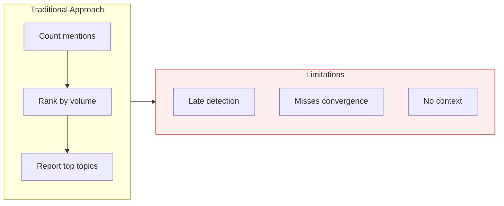
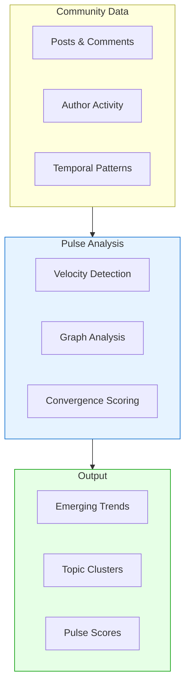
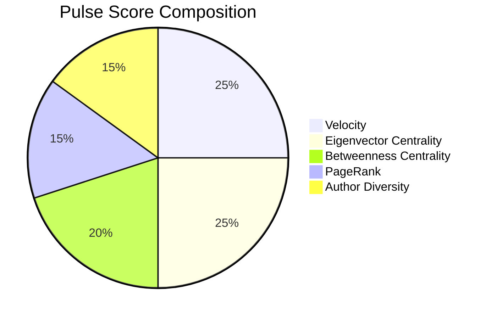
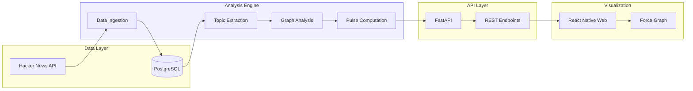
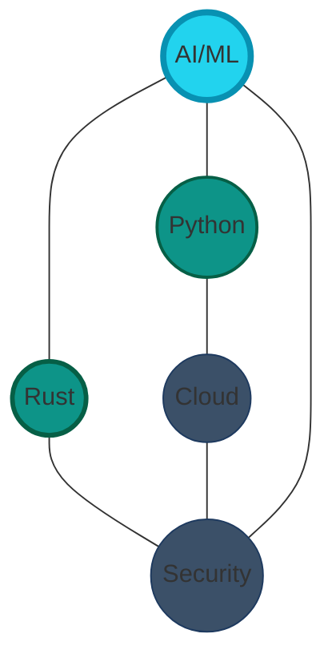
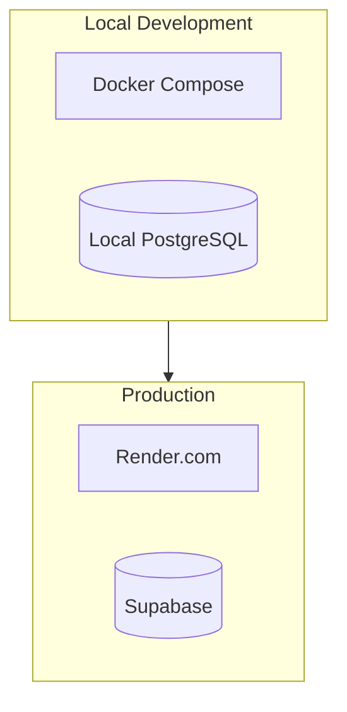
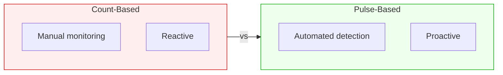

# Community Pulse

**Detecting Emerging Topics via Velocity and Graph Analysis**

---

## The Challenge

Online communities generate high message volumes. Count-based trend detection methods often lag because they:

- React after mention counts have already peaked.
- Miss convergence patterns where multiple voices independently discuss a topic.
- Ignore the network structure of how information flows between topics.



**Result**: Count-based dashboards often report trends only after they have become mainstream.

---

## Methodology

Community Pulse identifies emerging topics by combining mention velocity with graph centrality metrics.



---

## Use Cases

| Audience | Application |
|----------|-------------|
| **Community Managers** | Identify rising discussions early. |
| **Product Teams** | Spot emerging user needs and feature requests. |
| **Research Analysts** | Track technology adoption shifts. |
| **Content Strategists** | Identify timely topics for content creation. |

---

## How It Works

### The Pulse Score Formula

The Pulse Score (0-100) combines five signals:



| Signal | Weight | What It Measures |
|--------|--------|------------------|
| **Velocity** | 25% | Rate of acceleration in mentions. |
| **Eigenvector Centrality** | 25% | Connection to other high-scoring topics. |
| **Betweenness Centrality** | 20% | Bridge topics connecting different clusters. |
| **PageRank** | 15% | Flow-based importance in the topic graph. |
| **Author Diversity** | 15% | Count of unique contributing authors. |

### Signal Rationale

- **Velocity**: Captures momentum (acceleration relative to baseline).
- **Eigenvector Centrality**: Identifies convergence (topics connected to other important topics).
- **Betweenness Centrality**: Reveals bridges (topics connecting separate clusters).
- **PageRank**: Measures authority (influence propagation).
- **Author Diversity**: Filters noise (prevents single-author dominance).

---

## Technical Architecture



### Key Technologies

| Component | Technology | Reasoning |
|-----------|------------|-----------|
| Graph Analysis | **rustworkx** | Rust-based performance for centrality calculations. |
| Database | **Supabase** | PostgreSQL with `pg_graphql`. |
| API | **FastAPI** | Async Python support. |
| Frontend | **React Native Web** | Cross-platform compatibility. |
| Visualization | **react-force-graph** | Interactive network rendering. |

---

## Visualization Views

### Topic Network

Topics appear as **nodes** connected by co-occurrence **edges**:



- **Node size**: Pulse score.
- **Node color**: Intensity.
- **Edge thickness**: Co-occurrence strength.

### Topic Cards

A list view showing:
- Topic name and pulse score.
- Velocity indicator.
- Mention and author counts.
- Trend sparkline.

---

## Deployment Options



| Environment | Database | API Hosting |
|-------------|----------|-------------|
| **Local Dev** | Docker PostgreSQL | localhost |
| **POC/Demo** | Supabase Free | Render Free |
| **Production** | Supabase Pro | Render Standard |

---

## Comparison



| Metric | Count-Based | Pulse-Based |
|--------|-------------|-------------|
| Detection Time | Post-peak | Emerging |
| Signal | Volume only | Velocity + Network |
| Context | List | Graph |

---

## Get Started

**Local Setup:**

```bash
git clone https://github.com/athola/community-pulse
cd community-pulse
docker compose up -d
open http://localhost:8081
```

**API Check:**

```bash
curl http://localhost:8001/pulse/current
```

---

## Summary

**Community Pulse** provides actionable trend intelligence by:

1. **Detecting velocity**: Finding topics accelerating faster than baseline.
2. **Measuring convergence**: Identifying organic emergence.
3. **Analyzing networks**: Mapping information flow between topics.
4. **Scoring pulse**: Combining signals into a single metric.

The result: **Early detection of rising topics.**

---

<div align="center">

**Community Pulse** | [GitHub](https://github.com/athola/community-pulse) | MIT License

</div>
